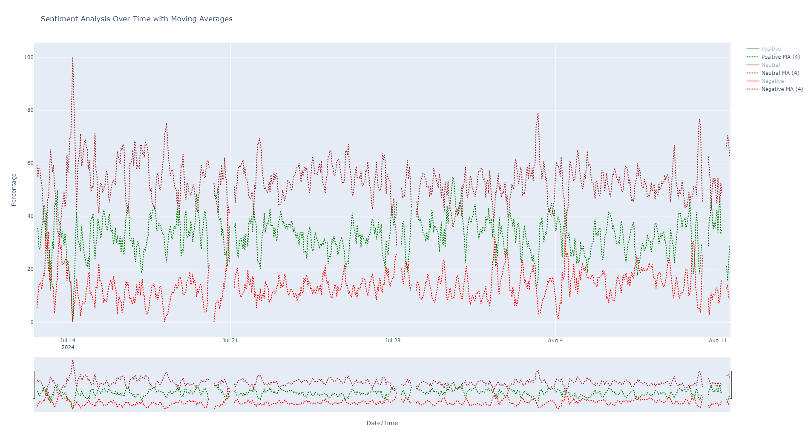

# Augmento.ai

This repo explores how to retrieve sentiment analyzed tweets and reddit posts on some of the cryptos supported by Augmento.ai.

## Coins.py

Retrieve all supported coins by sentiment analysis.

## Topics.py

Retrieve list of topics identified by sentiment analysis.

## augmentoai.py

Get the percentage of messages with positive, neutral and negative sentiments for a given crypto.

## All_coins.py

Generalized augmentoai.py with rowling means of trends with a 4 hour window. Calculation of a "Custom_Score" to get an idea, out of 100, of the general market sentiment for a given crypto.

## Plot.py

Plot the curves of percentages for positive, neutral and negative sentiments as well as their rowling means.

